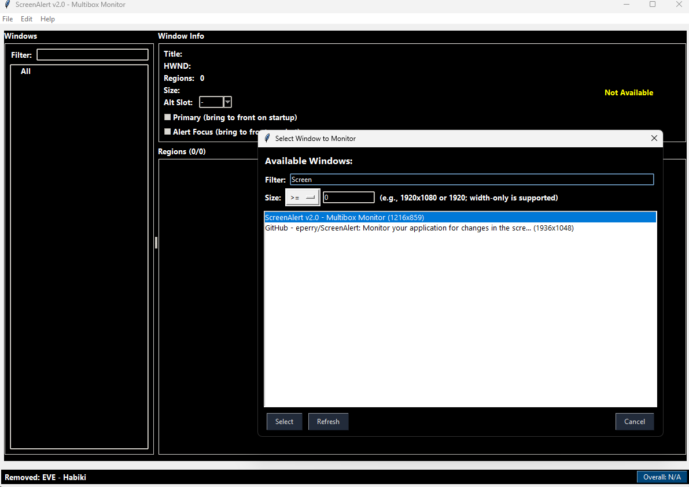
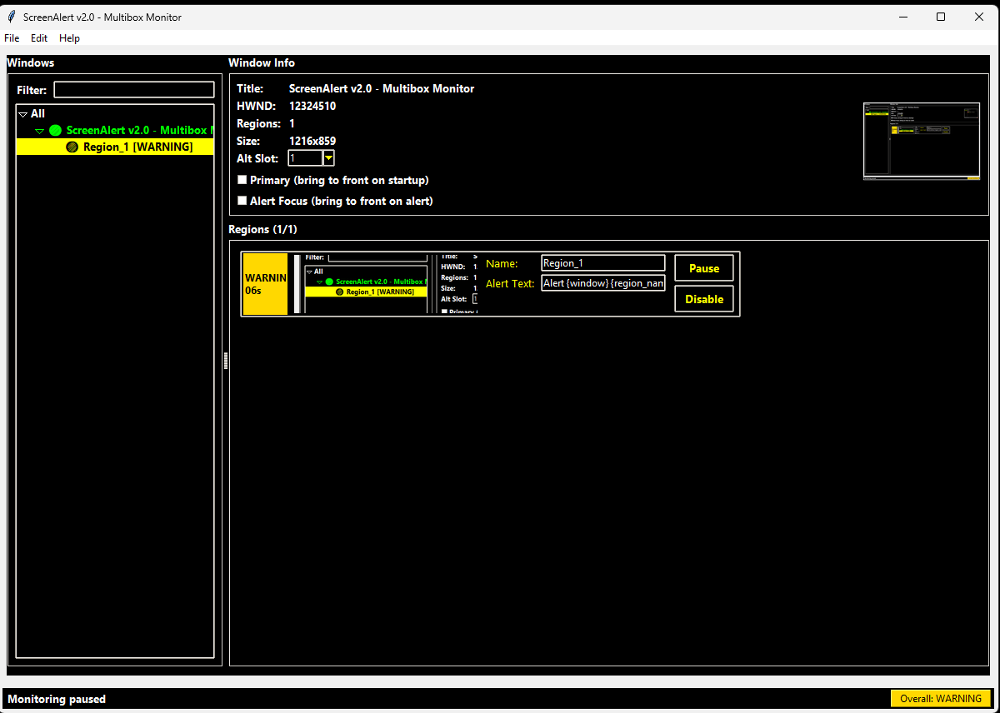
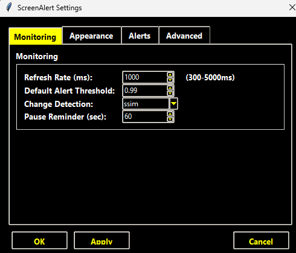

# ScreenAlert

ScreenAlert is a Windows desktop monitoring tool that watches selected regions of application windows for visual changes and alerts you in real time. It is built for situations where you need to track activity across multiple windows simultaneously — without automating or interacting with those windows.

ScreenAlert observes, compares, and reports. It does not click, type, or automate anything in the monitored applications.

---

## Screenshots

Settings dialog



Window selection dialog



Main dashboard with active region



---

## Installation (Windows)

**Requirements:** Python 3.9 or higher must be installed and on your PATH.

Run the installer once to set up a virtual environment and install all dependencies:

```bat
install.bat
```

This will:

- Detect your Python installation (3.9+ required)
- Create a `.venv` virtual environment in the project directory
- Install all required packages from `screenalert_requirements.txt`

Once installed, launch the app with:

```bat
launch_ScreenAlert.bat
```

The launcher automatically uses the virtual environment and starts the app in the background. Only one instance can run at a time — duplicate launches are silently ignored.

---

## AI Integration (MCP)

ScreenAlert 2.0.7+ includes a built-in MCP (Model Context Protocol) server that lets Claude Desktop, Claude Code, and any MCP-compatible AI client monitor, query, and control ScreenAlert in real time.

The server starts automatically with the app (toggle via the **MCP: On / Off** button in the status bar). Connection details — URL, port, and API key — are shown in **Help → MCP Server…**.

**28 tools** are exposed: add/remove windows and regions, read alert state, acknowledge alerts, pause/resume monitoring, query the event log, capture diagnostic images, and more.

**To connect Claude Desktop or Claude Code CLI, see the setup guide:**
[docs/MCP_SETUP.md](docs/MCP_SETUP.md)

---

## Features

### Multi-Window Monitoring

- Add any number of open application windows to the monitor list
- Each window is tracked by persistent identity metadata, so monitoring survives window moves, resizes, and minimizes
- Detects when a monitored window is closed or lost and notifies you
- Background auto-discovery reconnects windows automatically when they reappear

### Region-Based Change Detection

- Draw one or more rectangular monitoring regions on any watched window using a visual drag-to-select editor
- Regions can be moved and resized after creation using drag handles
- Each region is monitored independently with its own settings
- Four detection methods available (configurable globally and per-region):
  - **SSIM** (Structural Similarity Index) — sensitive to subtle pixel-level changes
  - **pHash** (Perceptual Hash) — robust to minor rendering differences
  - **Edge Detection** (Canny) — compares edge outlines; ignores color and gradient shifts
  - **Background Subtraction** (MOG2) — learns the background over time; detects new foreground activity
- Configurable alert threshold per region (0.10–1.00, default 0.99)
- Configurable refresh rate (300–5000ms, default 1000ms)

### Alert State Machine

Each monitored region runs a timed state machine:

| State | Color | Meaning |
| --- | --- | --- |
| OK | Green | No change detected |
| Alert | Red | Change detected — alert is active |
| Warning | Orange | Was alerted, no new change, cooling down |
| Paused | Blue | Monitoring paused by user |
| Disabled | Orange | Region disabled or no window attached |

### Audio Alerts

- **Text-to-Speech (TTS):** Speaks a configurable alert message using Windows SAPI (via PowerShell)
- **Sound file playback:** Play any audio file on alert using the pygame mixer
- Both TTS and sound can be enabled or disabled independently per session

### Live Thumbnail Overlays

- Each monitored window gets a floating DWM-composited thumbnail overlay at up to 30 FPS
- Per-overlay controls: opacity, always-on-top, border, resize, scaling mode (Fit / Stretch / Letterbox)
- Left-click drag to move; right-click drag to resize; Shift+right-click to sync-resize all overlays
- Overlay visibility toggles per window; closing an overlay does not stop monitoring

### Focus-on-Alert

- When an alert fires, ScreenAlert can automatically bring the alerting window to the foreground
- Configurable cooldown prevents focus from thrashing during repeated alerts

### Theme Presets

Four built-in themes selectable at runtime with live preview:

- **Default** — dark with orange accents
- **Slate** — muted blue-grey
- **Midnight** — deep blue-black
- **High Contrast** — maximum visibility for accessibility

### Configuration Persistence

- All settings are saved automatically to JSON config files in `%APPDATA%\ScreenAlert\`
- Persists across restarts: windows, regions, positions, sizes, thresholds, alert text, and UI state
- Supports a custom config file path via `--config` command-line flag

### Event Log

- JSONL event log records every significant event — alerts, reconnects, settings changes, MCP actions
- Queryable via the MCP `get_event_log` / `get_event_summary` tools
- Configurable retention and enabled/disabled toggle

### Headless Mode

Run monitoring without any UI (useful for server use or scripting):

```bat
.venv\Scripts\python.exe screenalert.py --headless
```

### Plugin Hook System

An in-process event hook registry lets developers register callbacks for monitoring events (alerts, region changes, window lost) without modifying core code.

---

## Command-Line Options

| Option | Description |
| --- | --- |
| `--config PATH` | Use a custom config JSON file |
| `--headless` | Run monitoring without the GUI |
| `--log-level LEVEL` | Set log level at launch: TRACE, DEBUG, INFO, WARNING, ERROR |
| `--verbose` | Alias for `--log-level DEBUG` |
| `--diagnostics` | Alias for `--log-level DEBUG` |
| `--thread-dump-interval N` | Dump all thread stacks every N seconds |
| `--dump-threads-now` | Write one immediate thread dump at startup |

---

## Dependencies

| Package | Purpose |
| --- | --- |
| Pillow | Image capture and processing |
| scikit-image | SSIM change detection |
| numpy | Array operations |
| opencv-python | pHash and background subtraction |
| imagehash | Perceptual hashing |
| pywin32 | Windows API (window capture, DWM thumbnails) |
| psutil | Process management |
| uvicorn / fastmcp | MCP server |
| pygame | Audio playback |

---

## Project Structure

```text
ScreenAlert/
├── screenalert.py               # Entry point
├── install.bat                  # Windows installer (sets up venv)
├── launch_ScreenAlert.bat       # Launcher (uses venv automatically)
├── screenalert_requirements.txt # Python dependencies
├── docs/
│   ├── MCP_SETUP.md             # Claude Desktop / Claude Code setup guide
│   ├── MCP_SPEC.md              # MCP server technical specification
│   ├── RELEASE_NOTES.md         # Version history
│   ├── ARCHITECTURE.md          # Internal architecture overview
│   └── LOGGING.md               # Logging configuration
├── tests/
│   ├── conftest.py              # Pytest fixtures (--live flag support)
│   └── test_mcp_tools.py        # MCP integration tests (84 tests)
└── screenalert_core/
    ├── screening_engine.py      # Main engine loop
    ├── core/
    │   ├── config_manager.py    # Settings persistence (3-file split)
    │   ├── window_manager.py    # Windows API integration
    │   ├── cache_manager.py     # Image capture cache
    │   ├── image_processor.py   # Image cropping and comparison
    │   └── change_detectors.py  # Modular detection framework
    ├── mcp/
    │   ├── server.py            # FastMCP + uvicorn HTTPS server
    │   └── tools/               # 28 MCP tools (windows, regions, monitoring…)
    ├── monitoring/
    │   ├── region_monitor.py    # Per-region state machine
    │   └── alert_system.py      # TTS and sound alerts
    ├── rendering/
    │   ├── overlay_window.py    # Native Win32 DWM overlay windows
    │   ├── overlay_adapter.py   # Overlay lifecycle management
    │   └── win32_types.py       # Win32 constants and structs
    ├── ui/
    │   ├── main_window.py       # Main control window
    │   ├── settings_dialog.py   # Settings UI
    │   ├── window_slot_mixin.py # Window slot management
    │   ├── engine_event_mixin.py# Engine→UI event delivery
    │   └── settings_mixin.py    # Runtime settings application
    └── utils/
        ├── constants.py         # App-wide constants
        ├── log_setup.py         # Logging initialisation and runtime level
        ├── diagnostics.py       # Alert diagnostic image saving
        ├── helpers.py
        ├── plugin_hooks.py      # Plugin event registry
        └── update_checker.py    # GitHub release checker
```

---

## Detection Methods

ScreenAlert supports four change detection algorithms. Each can be set as the global default or overridden per region.

### SSIM (Structural Similarity)

Compares luminance, contrast, and structure between frames. Produces a similarity score from 0.0 (completely different) to 1.0 (identical). An alert fires when the score drops below the configured threshold.

**Best for:** General-purpose monitoring where you need accurate, pixel-aware change detection. Works well for dashboards, chat windows, and static UIs.

### pHash (Perceptual Hash)

Computes a compact visual fingerprint of each frame and compares them. More tolerant of minor rendering differences (anti-aliasing, subpixel shifts) than SSIM.

**Best for:** Monitoring windows where minor rendering jitter causes false positives with SSIM.

### Edge Detection (Canny)

Detects edges (outlines) in each frame and compares the edge maps. Only structural changes trigger alerts — color shifts, gradient animations, and brightness changes are ignored.

**Best for:** Game UIs and applications with animated or dynamic backgrounds.

### Background Subtraction (MOG2)

Learns what the "normal" background looks like over time, then flags sudden foreground activity. Gradual changes are absorbed into the background model.

**Best for:** Scenes with a stable background where you want to detect new objects, movement, or pop-ups.

---

## Author

Ed Perry — [https://github.com/eperry/ScreenAlert](https://github.com/eperry/ScreenAlert)
